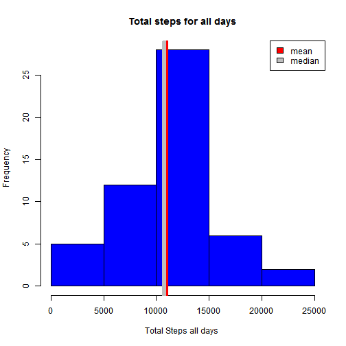

##Reproducible Research <br> --*class project 1* <br><hr>

## Loading and preprocessing the data
The data consists of two months of data from an anonymous individual collected during the months of October and November, 2012 and include the number of steps taken in 5 minute intervals each day.

orignial data can be found at:

https://d396qusza40orc.cloudfront.net/repdata%2Fdata%2Factivity.zip

load the original unziped data file

```r
activity_tb <- read.csv("activity/activity.csv",stringsAsFactors=F)
```

<hr>

## What is mean total number of steps taken per day?

```r
#aggregate the total steps by date 
attach(activity_tb)
```

```
## The following objects are masked from activity_tb (pos = 3):
## 
##     date, interval, steps
```

```r
tot_steps<-aggregate(activity_tb$steps,by=list(dates=date),FUN=sum,rm.na=TRUE)

mean_n <- as.integer(mean(tot_steps$x,na.rm=T))
mid_n <- median(tot_steps$x,na.rm=T)

hist(tot_steps$x,
     main="Total steps for all days",
     xlab="Total Steps all days ",
     col='blue',
     )
#move red and gray lines apart so they are visible
#actual values will print below
abline(v = mean_n+dm, col = "red", lwd = 6)
abline(v = mid_n, col = "gray", lwd = 6)
legend("topright",legend=c("mean ","median "),fill=c("red","gray"))
```

 

### The mean total steps : 10767 

### The median total steps : 10766 

****

## What is the average daily activity pattern?


```r
#not using NAs here so just dump them
#then aggregate on avg steps by interval

clean_activity_tb <- activity_tb[which(!is.na(activity_tb$steps)),]

#asbi -> Average Steps By Interval
asbi<-aggregate(clean_activity_tb$steps,
                            by=list('interval'=clean_activity_tb$interval),
                            FUN=mean)

# TIME Keeping clean up
# get a vector of minutes from 0 without the hour value breaks
# ie. 55 to 60 insted of 55 to 100
minutes <- asbi$interval %/% 100 * 60 + asbi$interval %% 100
# make a new dataframe for referance
asbi$min <- minutes 

par(mar=c(5,5,8,3))
#using asbi avg steps by int above
plot(asbi$min,asbi$x,
     type='l',
     ylab="Average steps over all days",
     xlab="five minute Intervals over 24 hours"
     )
title("Mean Total Steps by Interval(na removed)",line=5)
mtext("Interval Numbers",side=3,line=3)
max_steps <- which(asbi$x==max(asbi$x))
max_int <- asbi[max_steps,'interval']
stpi<- paste("Most steps in interval #",as.character(max_int))
abline(v=asbi[max_steps,'min'],
      col="red",
       lwd=4)

il <- as.character(as.integer(quantile(asbi$interval,probs=seq(0,1,.125),names=F)))

ml <- quantile(asbi$min,probs=seq(0,1,.125))

axis(3,at=ml,labels=il,fg="red",lwd=3)
               
               
               
legend("topright",legend=stpi,fill="red")
```

 
***

## Imputing missing values

replace NA steps values with the median for that interval

<b>First check that all NAs are in the steps variable:</b>


```r
###NOTE could have used summary here but I wanted to generate
#a success or fail message

# are there NAs in any variable besides "steps" ?
#dont like magic num but steps is col 1
cc     <- which(is.na(activity_tb[ ,-1]))
narows <- which(is.na(activity_tb[ ,'steps']))

# count of "steps" NAs
cnt1 <-length(narows)

# count of "non-steps" NAs
cnt2 <-length(cc)

OK = "Variables other than steps have NAs to check"

if(cnt2 == 0){
  OK <- "Only need to worry about NAs in steps variable"
}
```


"steps" variable NA count == 2304

Other variables NA count == 0

result: Only need to worry about NAs in steps variable

<b>Now set those NAs to the median for all days for that interval:</b>

```r
#copy the activity_tb to preserve it
act_tb <- activity_tb

#get a table of median values to select replacements from
mids_tb<-aggregate(act_tb$steps,
                            by=list('interval'=act_tb$interval),
                            FUN=median,
                            na.rm = TRUE
                   )
#get a vector of NA row numbers
narows <- which(is.na(act_tb[ ,'steps']))

for(n in narows){
  i <- act_tb[n,'interval']  
  act_tb[n,'steps']<- mids_tb[which(mids_tb$interval==i),'x']

}


#redo step 1 with filled data

t_steps<-aggregate(act_tb$steps,by=list(dates=date),FUN=sum,rm.na=TRUE)

mean_n2 <- as.integer(mean(t_steps$x))
mid_n2 <- median(t_steps$x)
dm <- 200*(mean_n - mid_n)
co <- rgb(1,1,0,0.5)

hist(t_steps$x,
     main="Total steps for all days\n yellow over blue is gray",
     xlab="Total Steps per day ",
     col='blue',
     breaks=20,
     )
hist(tot_steps$x,
     col= co,
     breaks=20,
     add=T
     )
#move red and gray lines apart so they are visible
#actual values will print below
abline(v = mean_n2, col = "red", lwd = 6)
abline(v = mid_n2, col = "gray", lwd = 6)
legend("topright",legend=c("mean ","median","nas replaced","nas removed"),
       fill=c("red","gray","blue",co))
```

 

### NAs replaced:

**Mean is 9504 steps and the Median is 10396 steps**

### NAs removed:

**Mean is 10767 steps and the Median is 10766 steps**

##Answers for assignment:

1 The values do differ from part 1 most if not all the replaced "NAs" are in a single range

2 The impact of imputting missing data has decresed the mean and median
total steps.

****

## Are there differences in activity patterns between weekdays and weekends?


```r
#Using act_tb (original data with nas replaced)
#get a vector of day names
wd <- weekdays(as.Date(act_tb[,"date"]))

#change them to weekday or weekend
wd[wd %in% c("Sunday","Saturday")]<-"weekend"
wd[wd != "weekend"]<-"weekday"  

#add this col to act_tb
act_tb$dtype <- wd  

# TIME Keeping clean up
# get a vector of minutes from 0 without the hour value breaks
# ie. 55 to 60 insted of 55 to 100
minutes <- act_tb$interval %/% 100 * 60 + act_tb$interval %% 100

# add min to act_tb
act_tb$min <- minutes 

#now make seperate tables for weekday and weekend
weekday_tb <- act_tb[which(act_tb$dtype =="weekday"),]
weekend_tb <- act_tb[which(act_tb$dtype =="weekend"),]

#aggregate the tables
weekday_tb<-aggregate(weekday_tb$steps,
                    by=list('min'=weekday_tb$min,'interval'=weekday_tb$interval),
                    FUN=mean
                    )
weekend_tb<-aggregate(weekend_tb$steps,
                    by=list('min'=weekend_tb$min,'interval'=weekend_tb$interval),
                    FUN=mean
                    )

# sync up the interval numbers with 5 min intervals 
il <- as.character(as.integer(quantile(weekday_tb$interval,
                              probs=seq(0,1,.125),names=F)))
ml <- quantile(weekday_tb$min,probs=seq(0,1,.125))


#prep the display
# 
par(mfrow=c(2,1),oma=c(4,2,2,0),pin=c(5.8,2),mar=c(0,2,0,2))

plot(weekday_tb$min,weekday_tb$x,
     type='l',axes=F,ann=F,ylim=c(0,240)
     )

#right side axes this plot only
axis(4)
#No left or top axes
axis(2,labels=F)
axis(3,at=ml,labels=F)
#draw border
box(which = "plot", lty = "solid" )

#put title inside plot area
mtext("Weekdays",side=3,line=-1)

xmin <- par("usr")[1]
xmax <- par("usr")[2]
ymin <- par("usr")[3]
ymax <- par("usr")[4]
color <- rgb(255, 203, 173, alpha=80, maxColorValue=255)
rect(xmin,ymax%/%1.15,xmax,ymax,col =color )

plot(weekend_tb$min,weekend_tb$x,
    type='l',axes=F,ylim=c(0,200)
     )


#use 5 min interval for ploting and interval numbers for display
# x bottom
axis(1,at=ml,labels=il)
#left access bottom plot
axis(2)
# add border
box(which = "plot", lty = "solid")

mtext("Weekends",side=3,line=-1)
#shade the text box
xmin <- par("usr")[1]
xmax <- par("usr")[2]
ymin <- par("usr")[3]
ymax <- par("usr")[4]
color <- rgb(255, 203, 173, alpha=80, maxColorValue=255)
rect(xmin,ymax%/%1.15,xmax,ymax,col =color )

# put axes labels in outer margins
mtext(c("Intervals", "Avg Number of Steps"),
      c(1,2),
      outer=TRUE,line=c(2,1))
```

 

From about 9am to 9pm on weekends there seems to be an increse in the avarage steps per inteval.


